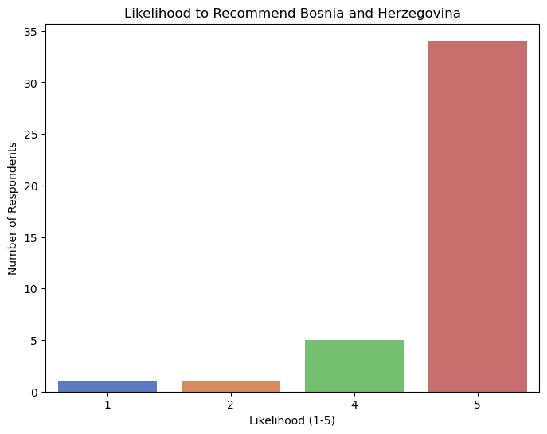
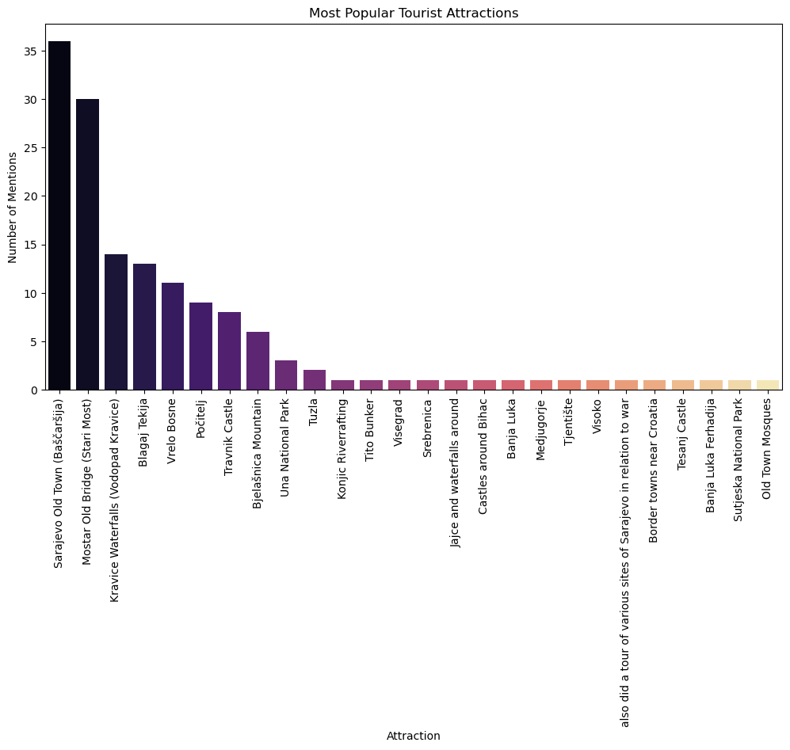
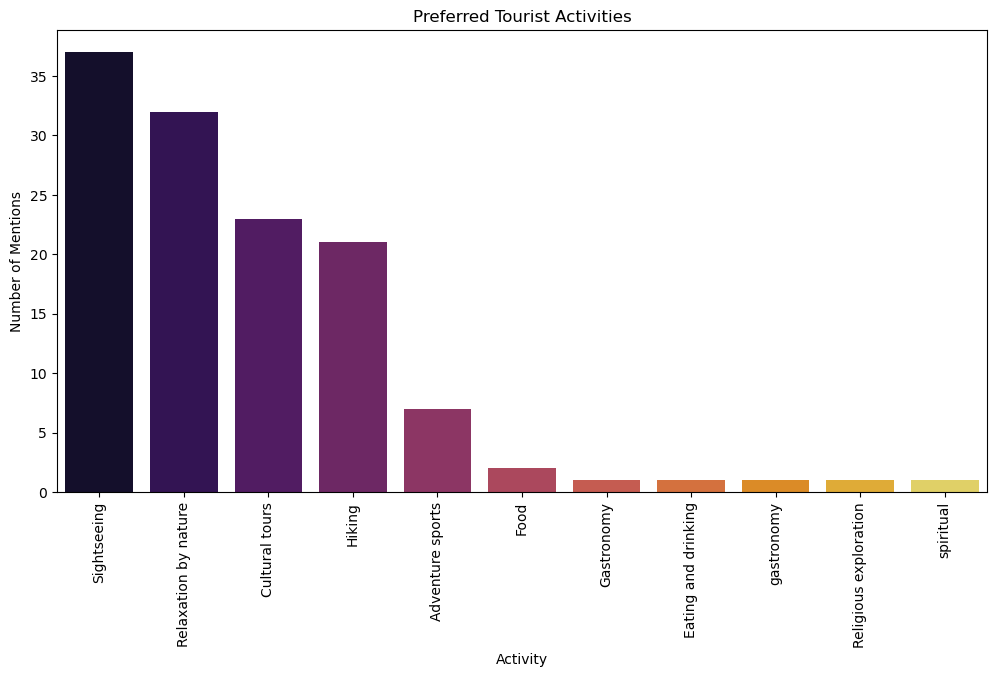
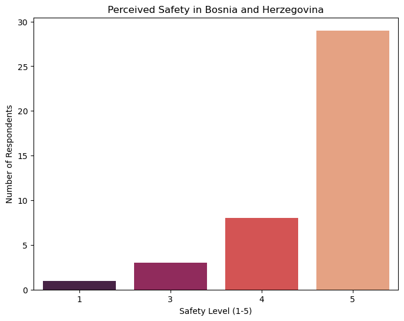
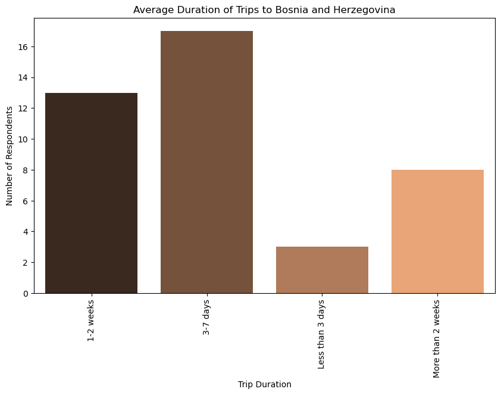
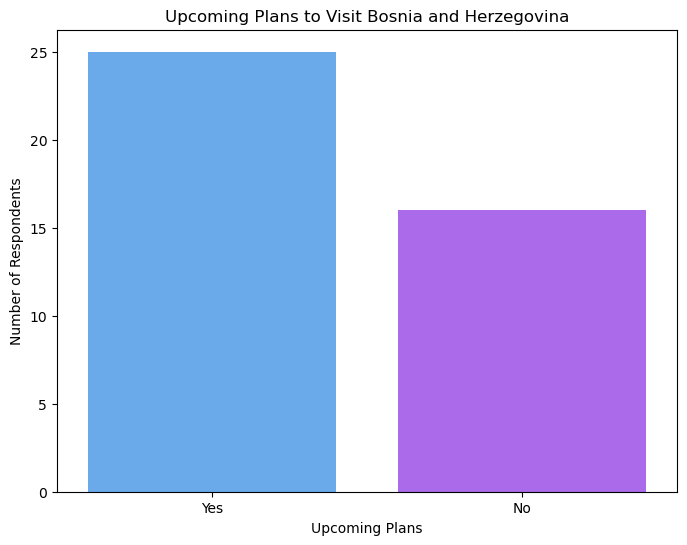
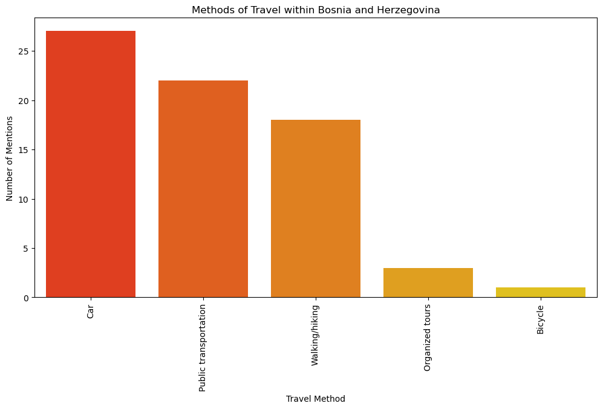
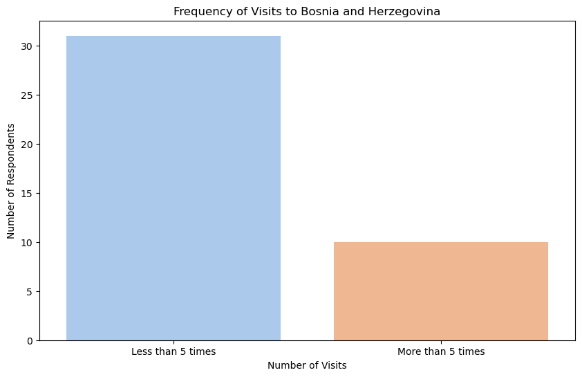

# Bosnia-and-Herzegovina-Tourism-Dataset
# Bosnia and Herzegovina Tourism Insights

This repository contains a dataset and analysis scripts aimed at understanding and improving the tourism experience in Bosnia and Herzegovina.

## About the Project

I created a survey form to gather information from tourists visiting Bosnia and Herzegovina. The responses include details about their nationality, satisfaction levels, preferred activities, and suggestions for improvement.

## What's Inside

- **Dataset**: The collected survey responses are stored in `Bosnia and Herzegovina tourism survey (Responses) - Form Responses 1.csv`.
- **Analysis Scripts**: Python scripts to explore and visualize the data.
- **Visualizations**: Graphs and word clouds to illustrate the insights from the data.

## How to Use

1. **Clone the Repository**
   ```bash
   git clone https://github.com/arnelasokolic1/Bosnia-and-Herzegovina-Tourism-Dataset.git

2.
**Install Required Libraries**

Make sure you have `pandas`, `seaborn`, `matplotlib`, and `wordcloud` installed. You can install them with:
```bash
pip install pandas seaborn matplotlib wordcloud

## Results 

<div align="center">
  
  
</div>
<br>
<div align="center">
  
  
</div>
<br>
<div align="center">
  
  
</div>
<br>
<div align="center">
  
  
</div>
<br>
<div align="center">
  
  
</div>
<br>
<div align="center">
  
  
</div>
<br>
<div align="center">
  
  
</div>
<br>
<div align="center">
  
</div>
